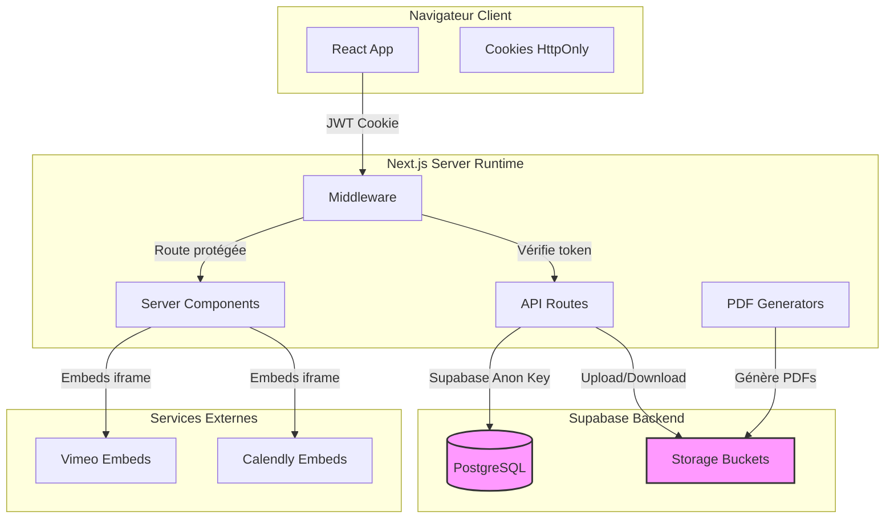
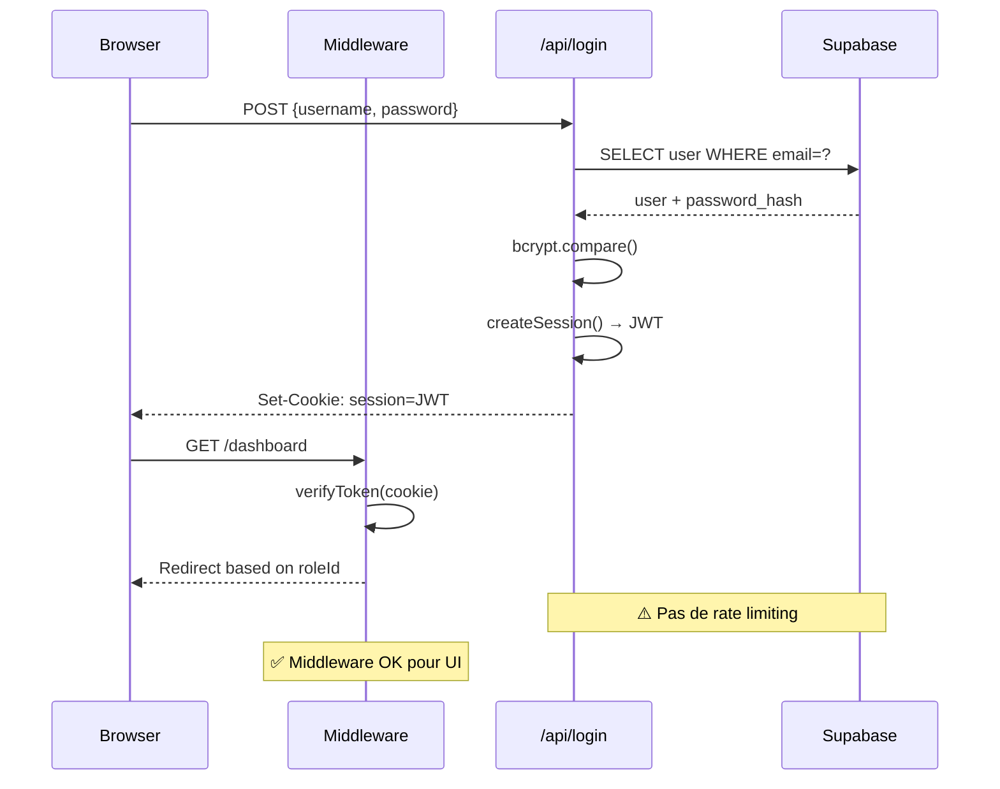
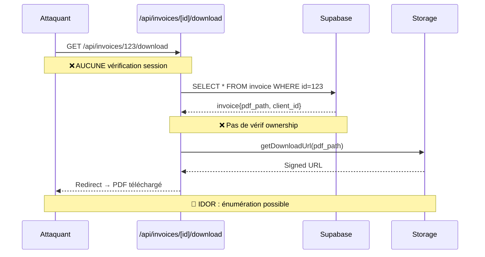

# AUDIT DE SÉCURITÉ - YOURSTORY AGENCY

**Date :** 29 décembre 2025  
**Auditeur :** Senior Application Security Engineer  
**Périmètre :** Application complète (dépôt Git actuel uniquement)  
**Stack :** Next.js 15 (App Router), React 19, TypeScript, Supabase, PDFKit

---

## RÉSUMÉ EXÉCUTIF

### 🔴 Niveau de risque global : **CRITIQUE**

Cette application présente **des vulnérabilités critiques** qui permettent à un attaquant non authentifié de :
- Accéder à toutes les factures, contrats et justificatifs de dépenses de tous les clients
- Modifier l'état des factures (marquer comme payées)
- Générer des factures récurrentes arbitraires
- Obtenir les hash de n'importe quel mot de passe via un endpoint de développement exposé

**L'application ne doit PAS être mise en production dans son état actuel.**

### Top 5 des risques critiques

| # | Vulnérabilité | Sévérité | Impact Business |
|---|--------------|----------|-----------------|
| 1 | **Aucune autorisation sur les API** | 🔴 Critique | Accès non autorisé aux données de tous les clients, manipulation des factures |
| 2 | **Endpoint hash-password en production** | 🔴 Critique | Génération de hash pour attaques par force brute, compromission des comptes |
| 3 | **Pas de RLS Supabase** | 🔴 Critique | Isolation tenant inexistante, fuite de données inter-clients |
| 4 | **IDOR sur téléchargements** | 🔴 Critique | Énumération et téléchargement de tous les documents (factures, contrats, reçus) |
| 5 | **Stored XSS via RichTextEditor** | 🟠 Élevé | Vol de sessions admin, injection de scripts malveillants |

### Statistiques de l'audit

- **Endpoints API analysés :** 13
- **Fichiers de code examinés :** 72+ (TypeScript/TSX)
- **Vulnérabilités critiques :** 4
- **Vulnérabilités élevées :** 4
- **Vulnérabilités moyennes :** 6
- **Vulnérabilités basses :** 3

---

## ARCHITECTURE ET FRONTIÈRES DE CONFIANCE

### Vue d'ensemble



### Frontières de confiance

| Frontière | Description | Niveau de confiance | Contrôles actuels |
|-----------|-------------|---------------------|-------------------|
| **Browser → Next.js** | Requêtes HTTP avec JWT cookie | ❌ Non vérifié | Middleware partiel (routes UI uniquement) |
| **Next.js → Supabase DB** | Requêtes SQL via SDK | ❌ Non sécurisé | Anon key sans RLS |
| **Next.js → Supabase Storage** | Upload/download fichiers | ⚠️ Partiellement sécurisé | Buckets privés mais pas de validation ownership |
| **Browser → Embeds externes** | iframe Vimeo/Calendly | ⚠️ Externe | CSP manquante |

---

## FLUX DE DONNÉES CRITIQUES

### 1. Authentification Admin



### 2. Téléchargement de facture (VULNÉRABLE)



---

## INVENTAIRE DES ENDPOINTS API

### Endpoints découverts dans le code

| Endpoint | Méthode | Auth | Authz | Risque |
|----------|---------|------|-------|--------|
| `/api/login` | POST | N/A | N/A | ⚠️ Pas de rate limit |
| `/api/logout` | POST | ✅ | N/A | ✅ OK |
| `/api/auth/session` | GET | ✅ | ✅ | ✅ OK |
| `/api/hash-password` | POST | ❌ | ❌ | 🔴 Exposé public |
| `/api/invoices/[id]/download` | GET | ❌ | ❌ | 🔴 IDOR |
| `/api/invoices/[id]/mark-paid` | POST | ❌ | ❌ | 🔴 Pas d'authz |
| `/api/invoices/[id]/qr-bill` | GET | ❌ | ❌ | 🔴 Pas d'authz |
| `/api/invoices/generate-pdf` | POST | ❌ | ❌ | 🔴 Pas d'authz |
| `/api/invoices/recurring/generate` | POST | ❌ | ❌ | 🔴 Pas d'authz |
| `/api/invoices/recurring/batch-generate` | POST | ❌ | ❌ | 🔴 Pas d'authz |
| `/api/contracts/generate` | POST | ❌ | ❌ | 🔴 Pas d'authz |
| `/api/contracts/[id]/download` | GET | ❌ | ❌ | 🔴 IDOR |
| `/api/expenses/[id]/receipt` | GET | ❌ | ❌ | 🔴 IDOR |

**Légende :**
- ✅ Implémenté correctement
- ⚠️ Implémenté partiellement
- ❌ Non implémenté / vulnérable

---

## MODÈLE DE MENACES (STRIDE)

### Scénarios d'attaque réalistes

#### 🎯 Attaque 1 : Énumération et vol de toutes les factures clients

**Attaquant :** Concurrent malveillant, ex-employé  
**Vecteur :** IDOR sur `/api/invoices/[id]/download`  
**Preuve de concept :**
```bash
# Script d'énumération (non exploitable en production)
for id in {1..1000}; do
  curl -s "https://app.example.com/api/invoices/$id/download" -o "invoice_$id.pdf"
done
```

**Impact :**
- Fuite de données financières de tous les clients
- Violation RGPD (données personnelles + financières)
- Perte de confiance totale

**Fichiers concernés :**
- `src/app/api/invoices/[id]/download/route.ts:1-47`

---

#### 🎯 Attaque 2 : Manipulation d'état des factures

**Attaquant :** Utilisateur malveillant  
**Vecteur :** `/api/invoices/[id]/mark-paid` sans autorisation  
**Impact :**
- Falsification de la comptabilité
- Pertes financières

**Fichiers concernés :**
- `src/app/api/invoices/[id]/mark-paid/route.ts:1-50`

---

#### 🎯 Attaque 3 : Génération de hash pour attaque par dictionnaire

**Attaquant :** Attaquant externe  
**Vecteur :** `/api/hash-password` exposé en production  
**Impact :**
- Facilite les attaques par force brute
- Rainbow tables

**Fichiers concernés :**
- `src/app/api/hash-password/route.ts:1-28`
- `middleware.ts:6` (route publique)

---

#### 🎯 Attaque 4 : Accès cross-tenant via Supabase

**Attaquant :** Client malveillant avec compte légitime  
**Vecteur :** Absence de RLS sur les tables Supabase  
**Exploitation :**
```javascript
// Depuis la console navigateur
const supabase = createClient(URL, ANON_KEY);
const {data} = await supabase.from('invoice').select('*');
// Retourne TOUTES les factures ❌
```

**Impact :**
- Fuite de données inter-clients
- RGPD : fuite de données personnelles

**Fichiers concernés :**
- `migrations/complete_database_schema.sql` (pas de POLICY)
- `lib/supabaseClient.ts:15-16`

---

#### 🎯 Attaque 5 : Stored XSS via scripts vidéo

**Attaquant :** Utilisateur admin compromis  
**Vecteur :** RichTextEditor utilisant `innerHTML` sans sanitization  
**Payload :**
```html

```

**Impact :**
- Vol de sessions admin
- Escalade de privilèges

**Fichiers concernés :**
- `src/components/editors/RichTextEditor.tsx:33`
- `src/app/(dashboard)/scripts/page.tsx:142-146`

---

## TABLEAU DES VULNÉRABILITÉS DÉTAILLÉES

### 🔴 CRITIQUES

#### VULN-001 : Absence totale d'autorisation sur les API routes

| Attribut | Détail |
|----------|--------|
| **Sévérité** | 🔴 **Critique** |
| **CWE** | CWE-862 (Missing Authorization) |
| **CVSS 3.1** | 9.1 (Critical) |
| **Impact** | Accès complet aux données de tous les clients, manipulation des factures |

**Fichiers concernés :**
- `src/app/api/invoices/[id]/mark-paid/route.ts:4-48`
- `src/app/api/invoices/[id]/download/route.ts:5-45`
- `src/app/api/invoices/generate-pdf/route.ts:8-95`
- `src/app/api/invoices/recurring/generate/route.ts:4-30`
- `src/app/api/invoices/recurring/batch-generate/route.ts:4-55`
- `src/app/api/contracts/generate/route.ts:9-112`
- `src/app/api/contracts/[id]/download/route.ts:5-40`
- `src/app/api/expenses/[id]/receipt/route.ts:5-38`

**Correction requise :**
```typescript
import { getSession } from '@/lib/auth';

export async function POST(request: NextRequest, { params }: any) {
  // 1. Vérifier la session
  const session = await getSession();
  if (!session) {
    return NextResponse.json({ error: 'Non authentifié' }, { status: 401 });
  }
  
  // 2. Vérifier le rôle admin (roleId === 1)
  if (session.roleId !== 1) {
    return NextResponse.json({ error: 'Accès refusé' }, { status: 403 });
  }
  
  // 3. Vérifier l'ownership (tenant isolation)
  const { data: invoice } = await supabase
    .from('invoice')
    .select('client_id')
    .eq('id', invoiceId)
    .single();
    
  if (session.roleId === 2 && session.clientId !== invoice.client_id) {
    return NextResponse.json({ error: 'Accès refusé' }, { status: 403 });
  }
  
  // Continuer...
}
```

---

#### VULN-002 : Endpoint de développement /api/hash-password exposé

| Attribut | Détail |
|----------|--------|
| **Sévérité** | 🔴 **Critique** |
| **CWE** | CWE-749 (Exposed Dangerous Method) |
| **CVSS 3.1** | 7.5 (High) |
| **Impact** | Génération de hash pour rainbow tables |

**Fichiers concernés :**
- `src/app/api/hash-password/route.ts:1-28`
- `middleware.ts:6`

**Correction requise :**
```typescript
export async function POST(request: NextRequest) {
  // Bloquer en production
  if (process.env.NODE_ENV === 'production') {
    return NextResponse.json({ error: 'Endpoint désactivé' }, { status: 404 });
  }
  
  // Vérifier clé secrète admin
  const adminKey = request.headers.get('X-Admin-Key');
  if (adminKey !== process.env.ADMIN_HASH_KEY) {
    return NextResponse.json({ error: 'Non autorisé' }, { status: 403 });
  }
  
  // Continuer...
}
```

---

#### VULN-003 : Absence de Row Level Security (RLS) Supabase

| Attribut | Détail |
|----------|--------|
| **Sévérité** | 🔴 **Critique** |
| **CWE** | CWE-284 (Improper Access Control) |
| **CVSS 3.1** | 8.1 (High) |
| **Impact** | Bypass complet de l'isolation tenant |

**Fichiers concernés :**
- `migrations/complete_database_schema.sql:1-564`
- `lib/supabaseClient.ts:15-26`

**Correction requise :**
```sql
-- Activer RLS sur toutes les tables
ALTER TABLE invoice ENABLE ROW LEVEL SECURITY;
ALTER TABLE client ENABLE ROW LEVEL SECURITY;
ALTER TABLE mandat ENABLE ROW LEVEL SECURITY;

-- Policies pour clients
CREATE POLICY "Clients voient leurs factures"
ON invoice FOR SELECT TO authenticated
USING (client_id = (SELECT client_id FROM app_user WHERE id = auth.uid()::integer));

-- Policies pour admins
CREATE POLICY "Admins voient tout"
ON invoice FOR ALL TO authenticated
USING (EXISTS (SELECT 1 FROM app_user WHERE id = auth.uid()::integer AND role_id = 1));
```

---

#### VULN-004 : IDOR sur tous les téléchargements

| Attribut | Détail |
|----------|--------|
| **Sévérité** | 🔴 **Critique** |
| **CWE** | CWE-639 (Authorization Bypass Through User-Controlled Key) |
| **CVSS 3.1** | 8.6 (High) |
| **Impact** | Téléchargement de tous les documents par énumération |

**Fichiers concernés :**
- `src/app/api/invoices/[id]/download/route.ts:5-45`
- `src/app/api/contracts/[id]/download/route.ts:5-40`
- `src/app/api/expenses/[id]/receipt/route.ts:5-38`

**Correction :** Voir VULN-001

---

### 🟠 ÉLEVÉES

#### VULN-005 : Stored XSS via RichTextEditor

| Attribut | Détail |
|----------|--------|
| **Sévérité** | 🟠 **Élevé** |
| **CWE** | CWE-79 (XSS) |
| **CVSS 3.1** | 7.1 (High) |
| **Impact** | Vol de sessions admin |

**Fichiers concernés :**
- `src/components/editors/RichTextEditor.tsx:33`
- `src/components/editors/RichTextEditor.tsx:194`

**Correction requise :**
```bash
npm install dompurify isomorphic-dompurify @types/dompurify
```

```typescript
import DOMPurify from 'isomorphic-dompurify';

useEffect(() => {
  if (editorRef.current && !isInitialized) {
    const sanitized = DOMPurify.sanitize(content, {
      ALLOWED_TAGS: ['b', 'i', 'u', 'h1', 'h2', 'h3', 'p', 'ul', 'ol', 'li', 'blockquote'],
      ALLOWED_ATTR: ['class'],
    });
    editorRef.current.innerHTML = sanitized;
  }
}, [content, isInitialized]);
```

---

#### VULN-006 : Absence de protection CSRF

| Attribut | Détail |
|----------|--------|
| **Sévérité** | 🟠 **Élevé** |
| **CWE** | CWE-352 (CSRF) |
| **CVSS 3.1** | 6.5 (Medium) |
| **Impact** | Actions non intentionnelles |

**Fichiers concernés :**
- `lib/auth.ts:76`

**Correction requise :**
```typescript
// Option 1 : SameSite=strict
sameSite: 'strict',

// Option 2 : Tokens CSRF
const csrfToken = generateCsrfToken();
// Vérifier dans chaque API POST
```

---

#### VULN-007 : Validation insuffisante fichiers uploadés

| Attribut | Détail |
|----------|--------|
| **Sévérité** | 🟠 **Élevé** |
| **CWE** | CWE-434 (Unrestricted Upload) |
| **CVSS 3.1** | 6.5 (Medium) |
| **Impact** | Upload de fichiers malveillants |

**Fichiers concernés :**
- `src/components/expenses/ExpenseForm.tsx:87-97`
- `lib/storageHelpers.ts:154-180`

**Correction requise :**
```typescript
const ALLOWED_TYPES = {
  'application/pdf': ['.pdf'],
  'image/jpeg': ['.jpg', '.jpeg'],
  'image/png': ['.png'],
};

// Vérifier MIME type + extension + magic bytes
const buffer = await file.arrayBuffer();
const bytes = new Uint8Array(buffer);
const isPDF = bytes[0] === 0x25 && bytes[1] === 0x50; // %PDF
```

---

#### VULN-008 : Absence de rate limiting

| Attribut | Détail |
|----------|--------|
| **Sévérité** | 🟠 **Élevé** |
| **CWE** | CWE-307 (Improper Authentication) |
| **CVSS 3.1** | 5.3 (Medium) |
| **Impact** | Bruteforce login |

**Fichiers concernés :**
- `src/app/api/login/route.ts:6-172`

**Correction requise :**
```bash
npm install @upstash/ratelimit @upstash/redis
```

```typescript
import { Ratelimit } from '@upstash/ratelimit';

const loginLimit = new Ratelimit({
  redis,
  limiter: Ratelimit.slidingWindow(5, '15 m'),
});

const { success } = await loginLimit.limit(ip);
if (!success) {
  return NextResponse.json({ error: 'Trop de tentatives' }, { status: 429 });
}
```

---

### 🟡 MOYENNES

#### VULN-009 : Secrets exposés via NEXT_PUBLIC_

| Attribut | Détail |
|----------|--------|
| **Sévérité** | 🟡 **Moyen** |
| **CWE** | CWE-200 (Information Exposure) |
| **CVSS 3.1** | 5.3 (Medium) |

**Fichiers :** `lib/supabaseClient.ts:15-16`

**Correction :** Activer RLS + créer client serveur séparé avec SERVICE_ROLE_KEY

---

#### VULN-010 : Calculs financiers côté client

| Attribut | Détail |
|----------|--------|
| **Sévérité** | 🟡 **Moyen** |
| **CWE** | CWE-602 (Client-Side Enforcement) |
| **CVSS 3.1** | 4.3 (Medium) |

**Correction :** Recalculer les totaux HT/TVA/TTC côté serveur

---

#### VULN-011 : Timing attack sur bcrypt.compare

| Attribut | Détail |
|----------|--------|
| **Sévérité** | 🟡 **Moyen** |
| **CWE** | CWE-208 (Observable Timing) |
| **CVSS 3.1** | 3.7 (Low) |

**Correction :** Toujours exécuter bcrypt.compare même si compte inexistant

---

#### VULN-012 : Logs contenant données sensibles

| Attribut | Détail |
|----------|--------|
| **Sévérité** | 🟡 **Moyen** |
| **CWE** | CWE-532 (Information in Log File) |

**Correction :** Masquer mots de passe, tokens, IBAN dans les logs

---

### ⚪ BASSES

#### VULN-013 : Headers de sécurité manquants

**Correction :** Ajouter CSP, X-Frame-Options, etc. dans `next.config.ts`

---

#### VULN-014 : Dépendances avec vulnérabilités

**Recommandation :** `npm audit` régulier

---

#### VULN-015 : Absence d'audit trail

**Correction :** Créer table `audit_log` avec triggers

---

## ROADMAP DE CORRECTION PRIORISÉE

### 🔥 Phase 1 : IMMÉDIAT (J+0 à J+7) - BLOQUANT PRODUCTION

**Critiques à corriger AVANT tout déploiement :**

| Tâche | Fichiers | Effort | Responsable |
|-------|----------|--------|-------------|
| ✅ VULN-001 : Ajouter `getSession()` + authz sur API | 8 routes | 6h | Backend Lead |
| ✅ VULN-002 : Supprimer/sécuriser `/api/hash-password` | 1 route + middleware | 30min | Backend Lead |
| ✅ VULN-004 : Vérif ownership sur downloads | 3 routes | 2h | Backend Lead |
| ✅ VULN-003 : Créer migrations RLS Supabase | migrations/ | 8h | DBA + Backend |

**Total Phase 1 :** 16,5 heures (~3 jours de dev)

**Critères de validation :**
- [ ] Tous les endpoints API vérifient la session
- [ ] Tests manuels : tentative d'accès cross-tenant bloquée
- [ ] `/api/hash-password` retourne 404 en production
- [ ] RLS activé sur toutes les tables sensibles
- [ ] Tests de non-régression sur fonctionnalités existantes

---

### 🟠 Phase 2 : URGENT (J+7 à J+30)

**Vulnérabilités élevées :**

| Tâche | Effort | Impact |
|-------|--------|--------|
| VULN-005 : Sanitization XSS (DOMPurify) | 4h | Empêche vol de sessions |
| VULN-006 : Protection CSRF (SameSite=strict) | 2h | Empêche actions non intentionnelles |
| VULN-007 : Validation uploads (magic bytes) | 6h | Empêche upload malware |
| VULN-008 : Rate limiting (Upstash) | 8h | Empêche bruteforce |

**Total Phase 2 :** 20 heures (~4 jours)

---

### 🟡 Phase 3 : IMPORTANT (J+30 à J+90)

**Durcissement et hardening :**

| Tâche | Effort |
|-------|--------|
| VULN-009 : Client Supabase serveur séparé | 3h |
| VULN-010 : Recalcul serveur totaux financiers | 4h |
| VULN-011 : Protection timing attack login | 1h |
| VULN-012 : Sanitization logs | 2h |
| VULN-013 : Headers sécurité (CSP, etc.) | 4h |
| VULN-015 : Audit trail basique | 8h |

**Total Phase 3 :** 22 heures

---

## CHECKLIST DE DURCISSEMENT

### Authentification & Sessions

- [ ] **JWT_SECRET** généré de façon cryptographiquement sûre (32+ bytes)
- [ ] JWT expiry configuré (actuellement 7 jours ✅)
- [ ] Cookie `HttpOnly` activé (✅)
- [ ] Cookie `Secure` en production (✅)
- [ ] Cookie `SameSite=strict` configuré
- [ ] Rate limiting sur `/api/login` (5 tentatives / 15 min)
- [ ] Logs d'échecs d'authentification
- [ ] Mécanisme de logout sur toutes les sessions
- [ ] Protection contre timing attacks (bcrypt toujours exécuté)

### Autorisation

- [ ] Vérification `getSession()` sur TOUS les endpoints API
- [ ] Vérification du rôle (roleId) selon l'opération
- [ ] Vérification ownership (client_id) pour isolation tenant
- [ ] Tests unitaires pour chaque règle d'accès
- [ ] RLS Supabase activé sur toutes les tables
- [ ] Policies RLS testées pour chaque rôle
- [ ] Aucune requête Supabase depuis le client sans RLS

### Validation des entrées

- [ ] Sanitization XSS sur tous les contenus HTML (DOMPurify)
- [ ] Validation des fichiers uploadés (MIME + extension + magic bytes)
- [ ] Taille max fichiers respectée (10MB ✅)
- [ ] Whitelist d'extensions autorisées
- [ ] Scan antivirus sur uploads (optionnel mais recommandé)
- [ ] Validation des paramètres d'URL (IDs numériques)
- [ ] Validation des JSON payloads (schémas Zod)

### Données sensibles

- [ ] Aucun secret dans le code source
- [ ] Variables d'environnement pour tous les secrets
- [ ] Pas de `NEXT_PUBLIC_` pour les clés privées
- [ ] IBAN/numéros de compte jamais loggés
- [ ] Mots de passe jamais loggés
- [ ] Tokens JWT masqués dans les logs
- [ ] Données personnelles chiffrées au repos (optionnel)

### Base de données

- [ ] RLS activé sur toutes les tables
- [ ] Policies pour chaque rôle (admin, client, staff)
- [ ] Aucune requête SQL brute (utiliser ORM/SDK)
- [ ] Indexes sur colonnes de recherche fréquentes (✅)
- [ ] Backups automatiques configurés
- [ ] Logs d'audit des opérations sensibles

### Fichiers & Storage

- [ ] Buckets Supabase privés (✅)
- [ ] Signed URLs avec expiration (3600s ✅)
- [ ] Vérification ownership avant génération signed URL
- [ ] Noms de fichiers non prédictibles (timestamp + random ✅)
- [ ] Pas d'exécution de scripts dans les buckets
- [ ] Domaine séparé pour servir les uploads (recommandé)

### API & Réseau

- [ ] Rate limiting sur tous les endpoints publics
- [ ] Headers de sécurité (CSP, X-Frame-Options, etc.)
- [ ] HTTPS obligatoire en production
- [ ] CORS configuré strictement
- [ ] Timeouts sur requêtes externes
- [ ] Retry logic avec backoff exponentiel

### Frontend

- [ ] Pas de secrets dans le bundle JavaScript
- [ ] CSP stricte pour bloquer inline scripts non autorisés
- [ ] Validation côté client (UX) + serveur (sécurité) ✅
- [ ] Protection contre clickjacking (X-Frame-Options: DENY)
- [ ] Subresource Integrity (SRI) sur CDN externes

### Monitoring & Logs

- [ ] Logs centralisés (Vercel/Sentry)
- [ ] Alertes sur échecs d'authentification répétés
- [ ] Alertes sur erreurs 500 inhabituelles
- [ ] Monitoring uptime
- [ ] Dashboard de métriques de sécurité
- [ ] Audit trail des actions admin sensibles

### DevOps & CI/CD

- [ ] `npm audit` dans la CI
- [ ] Scan de vulnérabilités automatique (Snyk, Dependabot)
- [ ] Variables d'environnement stockées de façon sécurisée
- [ ] Secrets rotationnés régulièrement
- [ ] Déploiements en rolling update (zero downtime)
- [ ] Rollback automatique en cas d'erreur

---

## QUESTIONS OUVERTES ET RECOMMANDATIONS

### Architecture

**Q1 :** Pourquoi ne pas utiliser Supabase Auth au lieu d'un système JWT custom ?

**Recommandation :** Migrer vers Supabase Auth permettrait :
- RLS natif avec `auth.uid()`
- Gestion des sessions robuste
- MFA/2FA prêt à l'emploi
- Réduction de la surface d'attaque

---

**Q2 :** Le portail client (`/client-portal`) est-il réellement utilisé ?

**Observation :** Un seul fichier `page.tsx` trouvé, très basique.

**Recommandation :** Si utilisé, appliquer les mêmes contrôles d'accès stricts. Si non utilisé, supprimer pour réduire la surface d'attaque.

---

**Q3 :** Quel est le modèle de déploiement cible ?

**Impact sécurité :**
- Vercel : Configuration des variables d'environnement sécurisées requise
- Self-hosted : Gestion des secrets (Vault, AWS Secrets Manager)
- Consideration pour les workers Supabase Edge Functions

---

### Conformité & Légal

**Q4 :** Quelle est la politique de rétention des données ?

**RGPD Article 5(1)(e) :** Les données ne doivent pas être conservées plus longtemps que nécessaire.

**Action requise :**
- Documenter la durée de rétention pour chaque type de données
- Implémenter suppression automatique après expiration
- Permettre aux clients de demander suppression de leurs données

---

**Q5 :** Y a-t-il une DPA (Data Processing Agreement) avec Supabase ?

**RGPD Article 28 :** Obligation de contrat écrit avec les sous-traitants.

---

**Q6 :** Les factures et QR-bills respectent-ils les normes suisses en vigueur ?

**Norme :** ISO 20022 pour les QR-bills suisses.

**Observation :** L'utilisation de `swissqrbill` (version 4.2.1) semble conforme, mais nécessite validation par un expert comptable suisse.

---

### Opérations & Incident Response

**Q7 :** Existe-t-il un plan de réponse aux incidents de sécurité ?

**Recommandation :** Documenter :
- Qui contacter en cas de faille découverte
- Procédure de rotation des secrets compromis
- Communication aux clients affectés
- Délais de notification RGPD (72h)

---

**Q8 :** Les backups Supabase sont-ils testés régulièrement ?

**Best practice :** Tester la restauration mensuelle pour vérifier l'intégrité.

---

### Tests & QA

**Q9 :** Quels tests de sécurité sont en place actuellement ?

**Recommandations :**
- Tests unitaires pour les règles d'autorisation
- Tests d'intégration pour les flux sensibles (paiement, génération PDF)
- Pentest externe annuel
- Bug bounty program (optionnel)

---

**Q10 :** Existe-t-il des environnements de staging/preprod isolés ?

**Risque :** Tests en production = risque de fuite de données réelles.

---

## ANNEXES

### Références de sécurité

- **OWASP Top 10 2021 :** https://owasp.org/Top10/
- **OWASP API Security Top 10 :** https://owasp.org/API-Security/
- **Next.js Security Best Practices :** https://nextjs.org/docs/app/building-your-application/authentication
- **Supabase Row Level Security :** https://supabase.com/docs/guides/database/postgres/row-level-security
- **CWE List :** https://cwe.mitre.org/

---

### Outils recommandés

| Outil | Usage | Priorité |
|-------|-------|----------|
| **DOMPurify** | Sanitization XSS | 🔴 Haute |
| **Upstash Redis** | Rate limiting | 🟠 Moyenne |
| **Zod** | Validation schemas | 🟡 Basse |
| **ESLint Security Plugin** | Détection vulns statiques | 🟡 Basse |
| **Snyk / Dependabot** | Scan dépendances | 🟠 Moyenne |
| **Sentry** | Monitoring erreurs | 🟠 Moyenne |

---

## CONCLUSION

Cette application présente **4 vulnérabilités critiques** qui doivent être corrigées **avant toute mise en production**. Les risques principaux sont :

1. **Absence d'autorisation** permettant l'accès aux données de tous les clients
2. **Absence de RLS** permettant le bypass de l'isolation tenant
3. **IDOR** permettant l'énumération de tous les documents
4. **Endpoint de dev exposé** facilitant les attaques

**Le temps estimé pour corriger les vulnérabilités critiques est de 3 jours ouvrés** (16,5 heures de développement + tests).

**Recommandation finale :** Ne PAS déployer en production avant correction de la Phase 1.

---

**Rapport généré le :** 29 décembre 2025  
**Version :** 1.0  
**Prochain audit recommandé :** Après implémentation des corrections (Phase 1)

